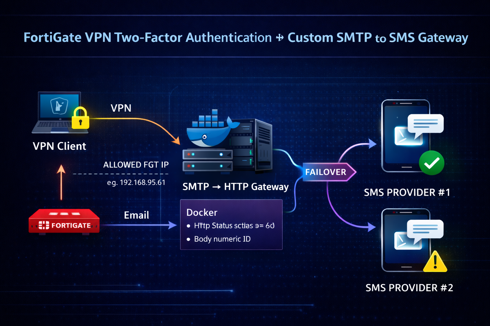

# FortiGate SMTP ➝ SMS 2FA Gateway

Deliver FortiGate VPN OTP codes via **SMS** instead of **Email** using a lightweight Dockerized SMTP → HTTP relay.

<p align="center">
  
</p>

---

## 📌 Project Description

Many organizations using **FortiGate SSL VPN Two-Factor Authentication** rely on **Email OTP delivery**.
But sometimes email is slow, blocked, unreliable, or simply not convenient for users.

So this project provides a **reliable bridge**:

| Input            | Output             |
| ---------------- | ------------------ |
| SMTP Email (OTP) | SMS to User Mobile |

This gateway listens on SMTP → extracts phone + OTP → sends to one of two SMS Providers.

---

## 🎯 Use Case

This project is ideal when:

* You use **FortiGate VPN with Email 2FA**
* You want OTP to be delivered **via SMS**
* You do not want to install additional authentication servers
* You prefer a **simple stateless microservice**
* You need **fallback SMS provider support**
* You want a solution that is

  * Lightweight
  * Reliable
  * Dockerized
  * Easy to deploy

Typical scenario:

> FortiGate sends OTP email → This service receives it → Extracts Mobile + OTP → Sends SMS → User logs in.

---

## 🏗 Architecture Overview

```
FortiGate (Email OTP)
        |
        | SMTP
        v
SMTP → SMS Gateway (Docker)
        |
        | HTTP API
        v
SMS Provider #1  ---> Success
        |
        | Fail
        v
SMS Provider #2  ---> Success
```

### Flow Explanation

1️⃣ FortiGate generates OTP
2️⃣ FortiGate sends OTP email to address like:

```
09123456789@sms.yourdomain.com
```

3️⃣ Docker service receives SMTP email
4️⃣ Script extracts:

* Phone Number
* OTP Code

5️⃣ Provider #1 sends SMS
6️⃣ If fails → Provider #2 sends SMS

---

## 🔧 FortiGate Configuration Hint

Enable Email for Two Factor Authentication and configure:

```
Email Server: <IP of Docker Server>
Port: 25
```

Then set user email as:

```
<MOBILE>@sms.domain.local
```

Example:

```
09123456789@sms.domain.local
```

FortiGate sends OTP email → gateway sends SMS → done ✔

---

## 🐳 Docker Run Guide

### 1️⃣ Clone Repository

```bash
git clone https://github.com/AlirezaSayyari/Fortigate-smtp2sms
cd Fortigate-smtp2sms
```

### 2️⃣ Configure Environment

Edit `docker-compose.yml` and set:

* Allowed SMTP Source IP (FortiGate IP)
* Provider API Keys / URLs

### 3️⃣ Run

```bash
docker-compose up -d
```

### 4️⃣ Check Logs

```bash
docker logs -f smtp2sms
```

---

## 🔁 Failover Logic

The gateway supports **dual SMS provider redundancy**.

1️⃣ Try Provider #1
2️⃣ If fails (timeout / HTTP error / provider rejects)
3️⃣ Automatically switch to Provider #2
4️⃣ Log the event

This ensures maximum OTP delivery reliability.

---

## 🧾 Logs

The service logs:

* Incoming SMTP session
* Extracted phone + OTP
* Provider request + response
* Failover trigger events
* Success delivery status

Example logs:

```
[INFO] Connection received
[INFO] Parsed Mobile: 09123456789
[INFO] Extracted OTP: 123456
[INFO] Sending via Provider #1
[INFO] Provider #1 FAILED — switching to Provider #2
[INFO] Provider #2 SUCCESS
```

---

## 🤝 Contribution

Contributions are absolutely welcome!

### Ways to contribute:

* Improve parsing logic
* Add more SMS providers
* Add GUI dashboard
* Add retry queue
* Add Kubernetes Helm chart
* Submit bug fixes

### Steps

1. Fork project
2. Create feature branch
3. Commit changes
4. Open Pull Request

---

## 📬 Contact

If you found this project useful — feel free to connect!

**Author:** Alireza Sayyari
**LinkedIn:** *linkedin.com/in/alireza-sayyari*
**GitHub:** *(You already are here 😎)*

---

## ⭐ Support

If this project helps you:

✔ Star the repo
✔ Share with others
✔ Contribute ideas
